<!--
Licensed to the Apache Software Foundation (ASF) under one
or more contributor license agreements.  See the NOTICE file
distributed with this work for additional information
regarding copyright ownership.  The ASF licenses this file
to you under the Apache License, Version 2.0 (the
"License"); you may not use this file except in compliance
with the License.  You may obtain a copy of the License at

  http://www.apache.org/licenses/LICENSE-2.0

Unless required by applicable law or agreed to in writing,
software distributed under the License is distributed on an
"AS IS" BASIS, WITHOUT WARRANTIES OR CONDITIONS OF ANY
KIND, either express or implied.  See the License for the
specific language governing permissions and limitations
under the License.
-->

# Test Quality — Mutation Kill Rate Across PRs

> **Last distilled:** 2026-05-13 · **Source of truth:** `.devin/mutation-testing/pr-*.md` log files · **Refresh:** [`devin-cron-distill.yml`](../../.github/workflows/devin-cron-distill.yml)

This page is the org-wide view of how well our test suite catches real regressions, aggregated across every PR that has run through the Devin mutation-testing workflow.

Coverage tells you which lines executed. **Kill rate tells you which lines are actually protected by assertions that would fail if the behaviour changed.** When you ask "is our test suite getting stronger?", this is the metric that answers honestly.

> **Where the live dashboard lives.** This file is a committed seed/snapshot only. The live dashboard is the **`Test Quality` page set on the [GitHub Wiki](https://github.com/loic-cunningham/superset/wiki/Test-Quality)** — `Test-Quality.md` is the index page, and each distillation run pushes a new dated entry `Test-Quality-YYYY-MM-DD.md` alongside it so the full history is preserved as append-only snapshots.

---

## What an engineering leader sees

```mermaid
xychart-beta
  title "Mutation kill rate per PR — initial vs. final"
  x-axis ["PR #30 (RLS)", "PR #31 (MCP filters)"]
  y-axis "Kill rate (%)" 0 --> 100
  bar [30, 80]
  bar [100, 100]
```

| PR | Title | Foundation? | Initial kill | Final kill | Line cov (final) | Tests added |
|---:|---|:---:|---:|---:|---:|---:|
| [#30](https://github.com/loic-cunningham/superset/pull/30) | fix(rls): prevent double-apply when converting physical dataset to virtual | no | 30% | **100%** | 79% → 93% | 4 new + 1 strengthened |
| [#31](https://github.com/loic-cunningham/superset/pull/31) | feat(mcp): include applied dashboard filters in get_chart_info | **yes** | 80% | **100%** | 74% → 85% (chart_helpers 29% → 100%) | 65 (63 foundation + 2 gap) |

**Headline numbers (last 30 days):** 2 PRs processed · 2/2 reached 100% kill rate · 1/2 needed a foundation phase · 69 tests added · 0 PRs left at unsafe kill rate.

---

## Patterns we keep finding

Each run logs *why* mutations survived. The same shapes recur — the test suite has predictable weak spots, and naming them lets reviewers catch them earlier.

| Pattern | Example PR | Why mutations slip past |
|---|---|---|
| **Clause-count assertions** | #30 (M1, M2, M10) | `len(clauses) == 5` doesn't notice when an operator flips (`!=` → `==`), an operand is hardcoded, or the wrapping `and_` becomes `or_`. Assert the structure, not the cardinality. |
| **Default-value propagation gaps** | #30 (M4, M5, M6, M7) | Tests only exercise the wrapper with `kwarg=None`, so dropping propagation of a non-default value through the call graph is invisible. Add at least one test per wrapper that passes a non-default value end-to-end. |
| **Column-equality silently relaxed to substring** | #31 (M1) | One-directional equality tests (`stat` doesn't match `state`) miss the inverse (`metro_state` matching `state`). Assert both directions when guarding against substring leakage. |
| **Foundation absent before mutation testing is meaningful** | #31 | Targeted line coverage on the new module was 29% / branch 10%. Mutation testing at that floor produces survivors that don't mean anything because the suite never executes the code. Always triage first; build foundation if needed. |

---

## Recommended next actions

Distilled from each PR's "What's left for high-quality coverage" section. Each item is a candidate to kick off a Devin session against, with mutation testing validating the result.

| Priority | Area | Action | Source |
|---|---|---|---|
| P1 | `superset/utils/rls.py` error path | Add a test that feeds unparseable SQL to `collect_rls_predicates_for_sql` and asserts `[]` (the `except Exception:` branch at lines 183-186). Only un-hit code path in the module. | PR #30 |
| P1 | Physical → virtual RLS conversion | Higher-level integration test that creates an RLS rule on `orders`, queries via a virtual dataset whose SQL references the same table, asserts predicates apply exactly once. Directly asserts the bug class at the API boundary. | PR #30 |
| P2 | Multi-statement virtual SQL | Run `collect_rls_predicates_for_sql` against a SQLScript with two statements; assert both tables are looked up. Inner-loop is touched but not asserted. | PR #30 |
| P2 | `get_chart_info` dashboard branch | Thin integration test against an in-memory Dashboard model to pin `get_chart_info.py:317-322` directly. Today covered only through mocks. | PR #31 |

These are not blockers. They are the residual gaps that mutation testing surfaced *after* the PR's targeted suite was closed to 100% kill rate. The expected workflow:

1. Engineer (or PM/lead) picks an item from this list.
2. Kicks off a Devin session: "improve test coverage on X per the action plan in `docs/test-quality/`."
3. Resulting PR runs through the same mutation-testing workflow — kill rate validates the new tests actually verify behaviour, not just cover lines.
4. The new log file feeds into the next weekly distillation.

This is the closed loop: real PR data → distilled patterns → targeted uplift work → mutation-verified → back into the knowledge base.

---

## How this is refreshed

This file is a **seed/snapshot** committed alongside the code so the dashboard exists even before the loop has run. The **live dashboard lives on the GitHub Wiki** — that's where the `Test Quality` page set is refreshed each cron pass and where a VP of engineering or PM naturally reads project documentation.

The wiki uses a **dated history** layout so every prior distillation is preserved as its own append-only snapshot, not overwritten in place:

* [`Test-Quality.md`](https://github.com/loic-cunningham/superset/wiki/Test-Quality) — the index page. One-line latest-run summary, a chronological history table, and the workflow description. Refreshed in place each pass.
* `Test-Quality-YYYY-MM-DD.md` — one **new** page per distillation run, written by the cron session. Contains the full distilled report (headline numbers, change-vs-previous-run, per-PR snapshot table, kill-rate trends, recurring patterns, recommended next actions, JA summary). Carries a YAML front matter block so the next run can parse it programmatically without re-reading the markdown body. **Never edited or deleted** after it lands — the closed-loop value comes from being able to read the trend across runs, not from a single ever-mutating page.

[`.github/workflows/devin-cron-distill.yml`](../../.github/workflows/devin-cron-distill.yml) spawns a Devin session on a configurable schedule. That session:

1. Reads every `.devin/mutation-testing/pr-*.md` log file in the repo (window default: 30 days).
2. Clones the wiki and **reads every prior `Test-Quality-YYYY-MM-DD.md` entry** — both their YAML front matter (for cross-run trend) and the most recent entry's recommendations (to mark items that subsequent PRs have addressed versus still-open).
3. Writes a new dated entry `Test-Quality-$(date -u +%Y-%m-%d).md` (or `-HHMM` if a same-day re-run) with the full distilled report.
4. Refreshes the index page `Test-Quality.md` in place: pointer to the new entry + a new row prepended to the history table.
5. Shares **title + headline summary + link to the new dated entry** through whatever notification channels the team configures — Slack, Linear, email digest, Teams (see the workflow's `notification_channels` input). The dashboard itself stays on the wiki; chat surfaces only carry the pointer.

The committed file you are reading is intentionally append-only between refreshes — it's the artifact the repo carries; the GitHub Wiki page set is the working surface. A senior engineer auditing "did Devin actually verify the change in PR #N?" follows the link to the per-PR log file below.

---

## Per-PR log files

* [`pr-30-2026-05-13-rls-double-apply.md`](../../.devin/mutation-testing/pr-30-2026-05-13-rls-double-apply.md)
* [`pr-31-2026-05-13-mcp-dashboard-filters.md`](../../.devin/mutation-testing/pr-31-2026-05-13-mcp-dashboard-filters.md)

Each log file is the full structured record of one PR's run: triage decision, foundation phase (if any), mutation plan, initial results, fix plan, final verification, and residual gaps. They conform to [`template_02_mutation_testing.md`](../../.devin/mutation-testing/templates/template_02_mutation_testing.md) and are validated by `lint_log.py` before commit.

JA — 日本語サマリー

**テスト品質 — PR ごとのミューテーションキル率**

カバレッジは「どの行が実行されたか」しか示しません。**キル率は「どの行がアサーションで実際に守られているか」を示します。** 「私たちのテストスイートは強くなっているか?」という問いに正直に答えるのはこの指標です。

直近 30 日の見出し: 2 PR 処理 · 2/2 が最終キル率 100% · 1/2 で基盤フェーズが必要 · 新規テスト 69 件追加 · 安全でないキル率で残っている PR は 0。

このページは `.devin/mutation-testing/pr-*.md` のログファイルから集約されます。本番では `devin-cron-distill.yml` の cron が Devin セッションを起動し、各実行で **新しい日付入りエントリ** (`Test-Quality-YYYY-MM-DD.md`) を Wiki に追加し、インデックスページ (`Test-Quality.md`) を更新します。過去のエントリは追記専用の履歴として保持されます。エージェントは新エントリを書く前に過去のエントリを読み、複数実行にまたがるトレンド分析と推奨アクションの解消状況を新エントリに反映します。チームメンバーはその推奨に対して Devin セッションを起動し、ミューテーションテストで結果を検証します — 真のループは「実 PR データ → 蒸留パターン → 重点的なカバレッジ強化 → ミューテーション検証 → 知識ベースへ還流」です。

